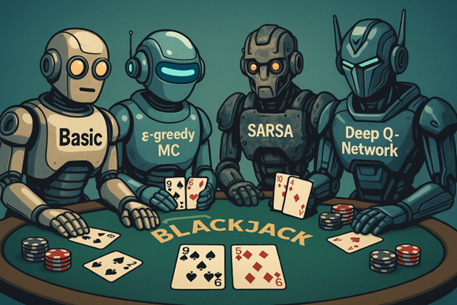

# Blackjack Reinforcement Learning Project 🎲🤖

This project presents a comparative analysis of four reinforcement learning (RL) agents trained to play Blackjack under realistic casino conditions. The study focuses on strategic decision-making, adaptive betting behavior, and the effectiveness of different learning paradigms. The agents implemented in this project are:

- **Basic Strategy Agent** - a non-learning benchmark based on mathematically optimal play
- **Monte Carlo (ε-greedy)** - a first-visit Monte Carlo learner using episode-based Q-value updates and adaptive bet sizing
- **SARSA (TD)** - an on-policy temporal difference learner that updates values incrementally after each action
- **Deep Q-Network (DQN)** - a neural-network-based agent leveraging function approximation and experience replay

---

## 📚 Project Overview

The Blackjack environment simulates a realistic multi-deck game using 6 shuffled decks (312 cards), incorporating core gameplay actions: `hit`, `stand`, `double`, and `split`. The environment also supports bet management, hand value evaluation, soft hand detection, and dealer logic according to standard casino rules.

Each agent interacts independently with the same environment, allowing for a controlled comparison of learning outcomes. Agents were trained over 100,000 episodes, with performance evaluated based on both pure gameplay (win rate) and economic outcomes (ROI, betting efficiency, and total money wagered). State representations include hand value, dealer upcard, soft-hand status, hand size, and discretized balance, enabling agents to learn both short-term tactics and long-term betting strategies.

---

## 📊 Performance Summary

The chart below summarizes the final performance metrics for each agent, including final balance, return on investment (ROI), total wagered amount, betting efficiency, and win percentage.

---

## 📁 Repository Contents

- `RL_Final_Project_2025.ipynb` - source code for environment and agent implementations
- `Blackjack Reinforcement Learning Project.pdf` - detailed final report documenting methodology, results, and analysis
- `figures/` - folder containing visualizations used in the report and README

---

## 👤 Author

Michael Mutter  
Instructor: Dr. Teddy Lazebnik  
Course: Introduction to Reinforcement Learning (Spring 2025)

